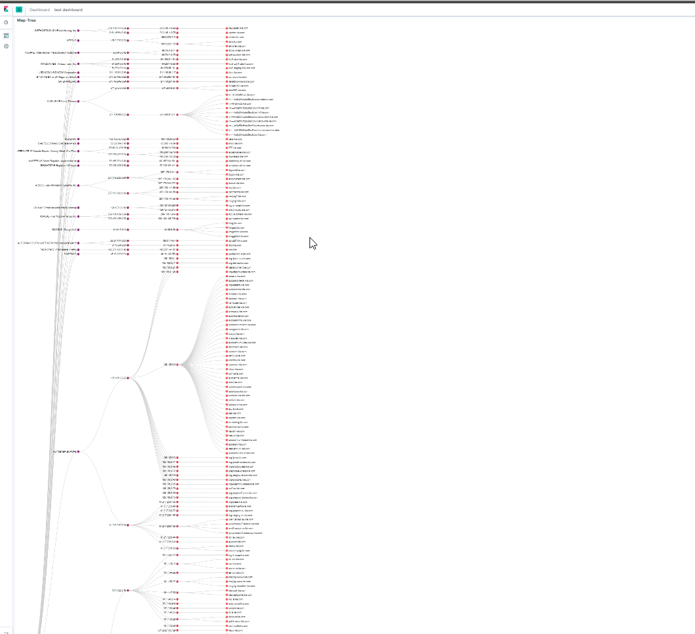

# Reconframework
Automate asset findings with open source tools, refine collected data and upload to elasticsearch

## Todo
- [ ] get js content and extract https://github.com/incogbyte/jsearch
- [ ] automate / file beat instead of manul upload
- [ ] cronjob
- [x] nmap, nikto vulners to es https://github.com/ChrisRimondi/VulntoES, https://github.com/marco-lancini/docker_offensive_elk
- [x] modifiy aquatone report / apache index page https://github.com/Vestride/fancy-index
- [ ] write elasticsearch module for quick update

## Screenshots
 
 
 
 
 
 
