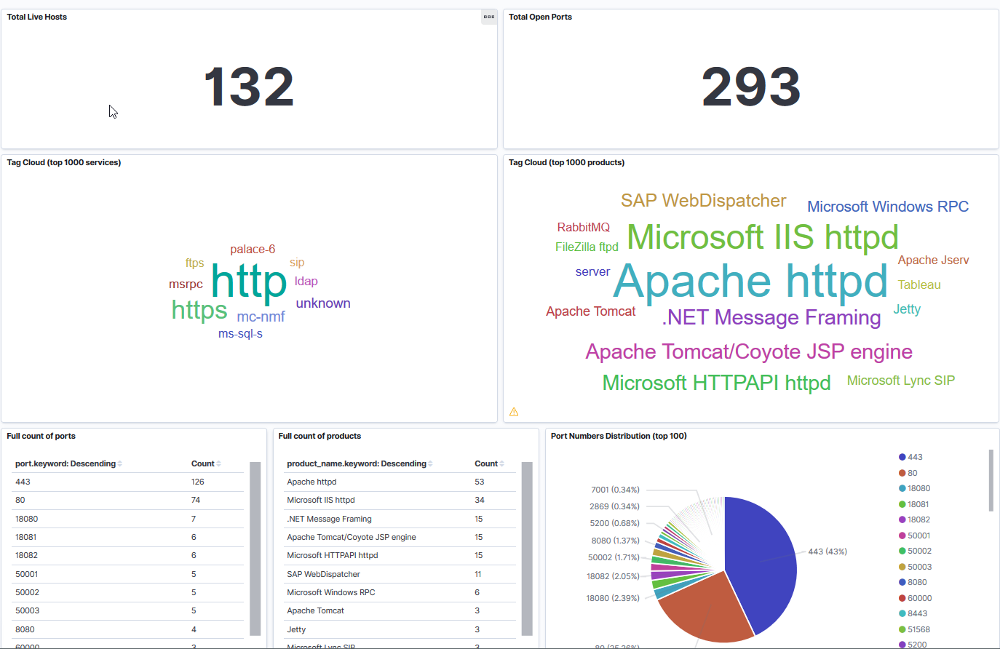

This is a partial copy from my private dev repo.

# Online asset finding
It's difficult to track all online asset and have bird's-eye view of their assets.
This approach will give company to have better awarenees on their assets and futhermore, 
pentester can specify scope easier with collected information 

Security team should be aware of their asset's status and risks and take proper actions before attackers abuse it. 

Automate subdomain findings with open source tools,
Perfrom enumeration to find vulnerabilities
refine collected data and upload it to elasticsearch
Visualize collected data

## Todo
- [ ] get js content and extract https://github.com/incogbyte/jsearch
- [ ] file beat instead of manul upload
- [x] nmap vulners to es https://github.com/marco-lancini/docker_offensive_elk
- [x] include webpage screenshot thumbnail 
- [x] Subdomain takeover check.
- [x] Draw network map from scan results(VEGA)
- [ ] write elasticsearch module for quick update
- [ ] cronjob

## Screenshots
#Domains dashboard
 
 
 
#Port scan dashboard https://github.com/marco-lancini/docker_offensive_elk
 
 
 

